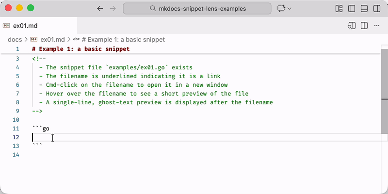
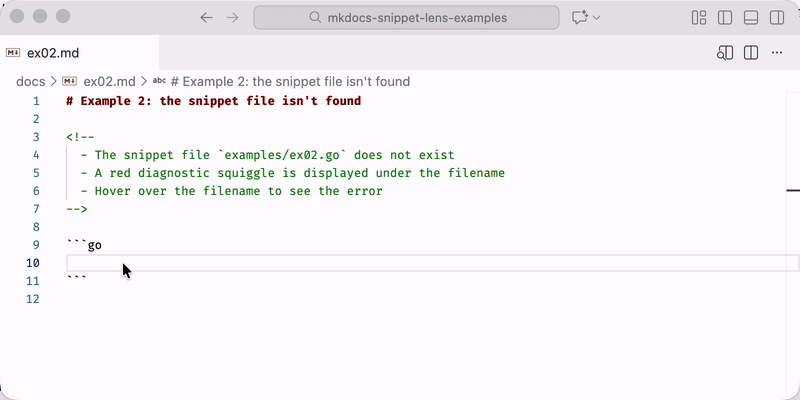

# MkDocs Snippet Lens

A Visual Studio Code extension that provides inline previews, clickable links, and
diagnostics for MkDocs `--8<--` snippet references in Markdown files.

## Features

- **Inline Previews**: See snippet content directly in your editor without opening the file
- **Clickable Links**: Navigate to snippet files with a single click
- **Error Diagnostics**: Get immediate feedback when snippet files are missing
- **Hover Previews**: View full snippet content on hover

### Clickable Links & Inline Previews

  

### Error Diagnostics

  

### Planned Features

- Named sections, line ranges, multiple ranges, negative indexes (advanced snippet syntax)
- Recursive snippet expansion and circular reference detection
- Performance and scalability for a large number of snippets or large snippet files
- Advanced error handling (invalid paths, permissions, section markers, recursion)
- Accessibility and i18n support
- Auto-refresh on snippet file changes

These features are planned for future releases.

## Installation

You can install MkDocs Snippet Lens from any of these sources:

- [VS Code Marketplace](https://marketplace.visualstudio.com/items?itemName=main-branch.mkdocs-snippet-lens)
- [Open VSX Registry](https://open-vsx.org/extension/main-branch/mkdocs-snippet-lens)
- [Download latest VSIX from GitHub Releases](https://github.com/main-branch/mkdocs-snippet-lens/releases/latest)

Or build from source.

## Extension Settings

This extension contributes the following settings:

- `mkdocsSnippetLens.basePath`: Base directory for resolving snippet paths (relative to
  workspace root)
- `mkdocsSnippetLens.previewMaxLines`: Maximum number of lines to show in inline preview
  (default: 20)
- `mkdocsSnippetLens.previewMaxChars`: Maximum number of characters to show in inline
  preview (default: 200)

## Commands

- `MkDocs Snippet Lens: Toggle All Previews`: Toggle inline previews on/off

## Known Issues

See the
[issue tracker](https://github.com/main-branch/mkdocs-snippet-lens/issues) for known
issues.

## Contributing

Contributions are welcome! Please read our
[Contributing Guide](CONTRIBUTING.md) for details on our development workflow,
including:

- Working on feature branches (never commit directly to `main`)
- Creating and submitting pull requests
- Rebase requirements for fast-forward merges
- Code review process

## License

This extension is licensed under the [MIT License](LICENSE).
